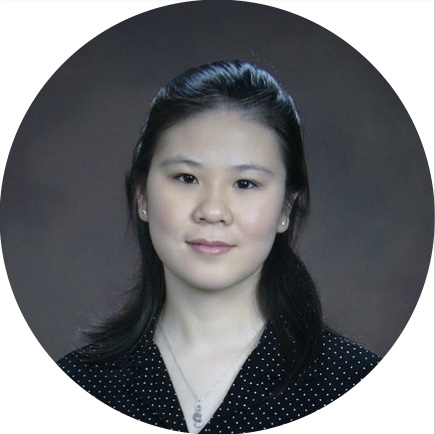
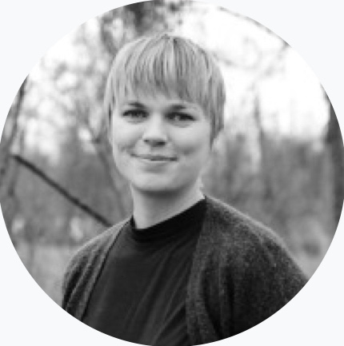
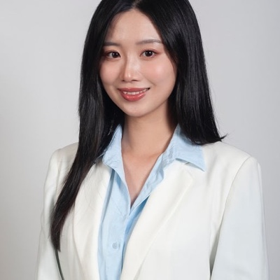
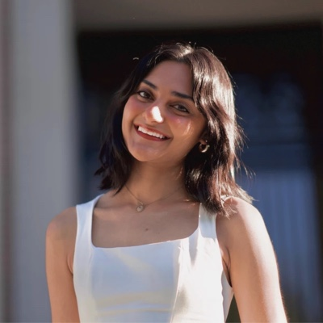

### [Mentoring and collaborators]{.center}

::: {.column-margin .dissertation-aside}
::: aside-highlight
#### Highlight

I view mentoring as the art of listening: through active sharing of ideas, concerns, and suggestions, both the mentee and the mentor can grow as scientists and as individuals. 
:::
:::

#### [Mentoring activity]{.blue} {.center}

Over the years, I have had the pleasure of mentoring these students, from whom I have learned a lot.

::: person-item
{.person}

::: person-body
[**Catherine Xue**](https://scholar.google.com/citations?user=V5VdV1gAAAAJ&hl=en) --- Ph.D. student at Harvard, now at Takeda.

Areas: Bayesian methods, cancer genomics, distribution theory.

See [Xue, Zito & Miller, 2024](https://arxiv.org/abs/2410.13050). [Recipient of the 2025 ASA SBSS Student Paper Competition Award](https://community.amstat.org/sbss/awards/sbssstudentpapercompetitionwinners587){.award-tag}
:::
:::

::: person-item
{.person}

::: person-body
[**Johanna Orsholm**](https://www.slu.se/en/profilepages/o2/johanna-orsholm/) --- Ph.D. student in ecology, Swedish University of Agricultural Sciences.

Areas: Machine learning, DNA classification methods, community ecology.

See [Orsholm, Zito et al., 2026](https://besjournals.onlinelibrary.wiley.com/doi/10.1111/2041-210x.70358), *Methods in Ecology and Evolution*.
:::
:::

::: person-item
{.person}

::: person-body
[**Zihan Qian**](https://biostatistics.massgeneral.org/team/zihan-qian-ms/) --- biostatistician, Massachusetts General Hospital.

Areas: Bayesian methods, cancer genomics, distribution theory, regression methods.
:::
:::

::: person-item
{.person}

::: person-body
[**Ashini Modi**](https://www.linkedin.com/in/ashini-modi-a793903a9) --- Incoming Master student at Cambridge University, UK.

Areas: Cancer genomics, statistical methods

See [Modi, Zito & Parmigiani, 2026](https://link.springer.com/article/10.1186/s12885-026-16895-2), *BMC Cancer*.
:::
:::

------------------------------------------------------------------------

#### [Advisors]{.harvardred} {.center}

-   [Jeffrey W. Miller](https://jwmi.github.io/index.html), Harvard University. [Postdoc advisor]{.orange}
-   [Giovanni Parmigiani](https://www.hsph.harvard.edu/profile/giovanni-parmigiani/), Harvard University, Dana-Farber Cancer Institute. [Postdoc advisor]{.orange}
-   [Mehmet K. Samur](https://www.dana-farber.org/find-a-doctor/mehmet-k-samur), Harvard University, Dana-Farber Cancer Institute. [Postdoc benefactor :)]{.orange}
-   [David B. Dunson](https://www.daviddunson.com/), Duke University. [Ph.D. advisor]{.orange}
-   [Tommaso Rigon](https://tommasorigon.github.io/), University of Milano-Bicocca. [Ph.D. co-advisor]{.orange}

#### [Co-authors and collaborators]{.blue} {.center}

-   [Nicolas Chazot](https://www.slu.se/en/ew-cv/nicolas-chazot/), Swedish University of Agricultural Sciences.
-   [Brendan Furneaux](https://www.jyu.fi/en/people/brendan-furneaux), University of Jyvaskyla.
-   [Dylan Greaves](https://www.linkedin.com/in/dylan-greaves/), Google.
-   [Changwoo J. Lee](https://changwoo-lee.github.io/), Duke University.
-   [Otso Ovaskainen](https://www.jyu.fi/en/people/otso-ovaskainen), University of Jyvaskyla.
-   [Lee Richardson](https://www.linkedin.com/in/lee-richardson-46180756/), Google.
-   [Tomas Roslin](https://www.slu.se/en/ew-cv/tomas-roslin/), Swedish University of Agricultural Sciences.
-   [Huiyan Sang](https://sites.google.com/site/huiyansang/), Texas A&M University.
-   [Jacopo Soriano](https://www.linkedin.com/in/jacsor/), Google.

------------------------------------------------------------------------
