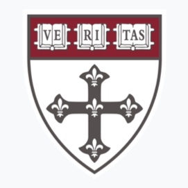
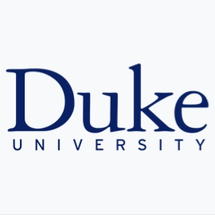
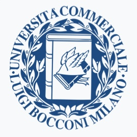

[Curriculum vitae](files/resume_alezito.pdf){.btn .btn-outline-primary .btn role="button" data-toggle="tooltip" title="CV"} [Linkedin](https://www.linkedin.com/in/alessandro-zito-92b250153/){.btn .btn-outline-primary .btn role="button" data-toggle="tooltip" title="linkedin"}

### Academic positions {.central}

::: {layout="[12, 0, 88]"}
::: {#second-column}

:::

::: {#middle-column}
:::

::: {#first-column}
[Harvard T.H. Chan School of Public Health]{.harvardred}, Department of Biostatistics, Boston, MA, U.S.A.

-   Postodoctoral research fellow. *September 2023 -- current*
-   Supervisors: [Jeffrey W. Miller](https://jwmi.github.io/index.html) and [Giovanni Parmigiani](https://www.hsph.harvard.edu/profile/giovanni-parmigiani/).
-   As of May 2025, I am also a Postdoctoral fellow at the Department of Data Sciences at the Dana Farber Cancer Institute
:::
:::

------------------------------------------------------------------------

### Work experience {.central}

::: {layout="[12, 0, 88]"}
::: {#second-column}

:::

::: {#middle-column}
:::

::: {#first-column}
[G]{.gblue}[o]{.gred}[o]{.gyellow}[g]{.gblue}[l]{.ggreen}[e]{.gred} [LLC]{.gblue}, San Bruno, CA, U.S.A.

-   Intern at the Youtube Data Science Team, *Summer 2022*.
-   Internship mentors: [Lee Richardson](https://www.linkedin.com/in/lee-richardson-46180756/) and [Jacopo Soriano](https://www.linkedin.com/in/jacsor/).
:::
:::

::: {layout="[12, 0, 88]"}
::: {#second-column}

:::

::: {#middle-column}
:::

::: {#first-column}
[Generali Italia S.p.A.]{.harvardred}, Milan, Italy.

-   Intern at the Advanced Analytics Solutions team, *June 2018 -- July 2019*.
-   Supervised by [Massimo Natale](https://www.linkedin.com/search/results/all/?fetchDeterministicClustersOnly=true&heroEntityKey=urn%3Ali%3Afsd_profile%3AACoAAAJrk8IBfZ9BLnYOW_Z4LjqKuzIodkKoBEc&keywords=massimo%20natale&origin=RICH_QUERY_SUGGESTION&position=0&searchId=a6d45994-4603-4ae2-9487-c9f3d90f4921&sid=CWy&spellCorrectionEnabled=false). Team lead by [Davide Consiglio](https://www.linkedin.com/in/davideconsiglio/).
:::
:::

------------------------------------------------------------------------

### Education {.central}

::: {layout="[12, 0, 88]"}
::: {#second-column}

:::

::: {#middle-column}
:::

::: {#first-column}
[Duke University]{.blue}, Department of Statistical Science, NC, U.S.A.

-   Ph.D. in Statistical Science, *August 2019 -- September 2023*.
-   Advisor: Professor [David B. Dunson](https://www.daviddunson.com/)
-   Co-advisor: [Tommaso Rigon](https://tommasorigon.github.io/)
-   Disseration: *Ecological modeling via Bayesian nonparametric species sampling priors*. [Link](https://www.proquest.com/openview/3aef46e2dd34370a7188063ec6efa951/1?pq-origsite=gscholar&cbl=18750&diss=y) [pdf](files/thesis_alezito.pdf) [Slides](files/defense_alezito.pdf)
:::
:::

::: {layout="[12, 0, 88]"}
::: {#second-column}

:::

::: {#middle-column}
:::

::: {#first-column}
[Bocconi University]{.blue}, Milan, Italy.

-   Master's degree in Economics and Social Sciences, *September 2016 -- March 2019*.
-   Graduation grade: 110 cum laude
-   Final thesis: *Conjugate Fractional Factorial Thompson Sampling via unified skew-normal*, with [Daniele Durante](https://danieledurante.github.io/web/) \[[pdf](files/master_thesis_alezito.pdf)\]
:::
:::

::: {layout="[12, 0, 88]"}
::: {#second-column}

:::

::: {#middle-column}
:::

::: {#first-column}
[Bocconi University]{.blue}, Milan, Italy.

-   Bachelor's degree in Economics and Social Sciences, *September 2013 -- September 2016*.
-   Graduation grade: 110 cum laude
-   Exchange program at The University of Chicago, Department of Economics, *Fall 2015*.
-   Research assistant at The University of Chicago, Department of Economics, *Summer 2016*, with [Melissa Tartari](https://sites.google.com/view/melissatartari/bio)
:::
:::

------------------------------------------------------------------------

### Awards {.central}
- \[[2025]{.blue}\]:  Travel grant (on competitive basis) for the [BNP14](https://bnp14.org/), Los Angeles, CA, USA. <!--($1000)-->
- \[[2024]{.blue}\]: [Savage Award in Applied Methodology](https://bayesian.org/project/savage-award/) <!--($1000) -->
-   \[[2023]{.blue}\]: [PQG travel award](https://www.hsph.harvard.edu/pqg/studentpostdoc-travel-fund/), Harvard T.H. Chan School of Public Health. <!--($500)-->
-   \[[2022]{.blue}\]: [BEST award for Ph.D. Student Research](https://stat.duke.edu/news/best-award-winners-2022) for the paper *Bayesian modeling of sequential discoveries*, Department of Statistical Science, Duke University. <!--($500)-->
-   \[[2022]{.blue}\]: Poster award at the [2022 ISBA World Meeting](https://isbawebmaster.github.io/ISBA2022/), Montreal, Canada. <!--(Won a book!)-->
-   \[[2022]{.blue}\]: Travel grant (on competitive basis) for the [2022 ISBA World Meeting](https://isbawebmaster.github.io/ISBA2022/), Montreal, Canada. <!--($300)-->
-   \[[2021]{.blue}\]: Ph.D. [Teaching assistant of the Year](https://stat.duke.edu/past-recipients), Department of Statistical Science, Duke University. <!-- ($1500)-->
-   \[[2021]{.blue}\]: Best [Postdoc/Student paper award at the 2021 ISBA World Meeting](https://stat.duke.edu/news/multiple-statsci-winners-isba-studentpostdoc-contributed-paper-awards), held online. <!--($1000)-->
-   \[[2016--2019]{.blue}\]: [Bocconi Merit Award Scholarship](https://www.unibocconi.eu/wps/wcm/connect/bocconi/sitopubblico_en/navigation+tree/home/programs/current+students/services/funding/master+of+science+programs/2022-23+bocconi+graduate+merit+awards) (full tuition covered, ~$12.000 per year).

------------------------------------------------------------------------

### Teaching experience

-   \[[Spring 2023]{.blue}\] - Teaching assistant, STA440 - Case Studies in the Practice of Statistics (undergraduate). Instructor: [Amy Herring](https://globalhealth.duke.edu/people/herring-amy). Duke University.
-   \[[Fall 2021]{.blue}\] - Teaching assistant, STA610 - Hiearchical models (graduate). Instructor: [Olanrewaju (Michael) Akande](https://www.olanrewajuakande.com/aboutme/). Duke University.
-   \[[Fall 2020]{.blue}\] - Teaching assistant, STA601 - Bayesian statistics (graduate). Instructor: [David B. Dunson](https://www.daviddunson.com/). Duke University. [Recipient of the 2021 Ph.D. Teaching assistant of the Year]{.orange}.
-   \[[Spring 2020]{.blue}\] - Teaching assistant, STA360 - Bayesian statistics (undergraduate). Instructor: [Simon Mak](https://sites.google.com/view/simonmak/home). Duke University.
-   \[[2016-2018]{.blue}\] - Instructor at [TEST WE CAN srl](https://www.amazon.it/Manuale-TestWeCan/dp/B08YHDN38H) - a complete coursework designed to prepare high school students for the Bocconi admission test. 

### Editorial and Referee work

-   I have served as reviewer for the following journals: *Electronic Journal of Statistics*, *Bayesian Analysis*, *Ecography*, *Philosophical transactions of the Royal Society A*, *Computational Statistics & Data Analysis*.

-   I have been a reviewer for the [SBSS Student Paper competition award at JSM2025](https://community.amstat.org/sbss/awards/sbssstudentpapercompetitionwinners587)

### Service to the community

-  \[[2025-2027]{.blue}\], Treasurer in the [j-ISBA board](https://j-isba.github.io/officers.html). Duties so far:
    - Part of the Scientific committee for BAYSM 2025 (held online) 
    - Lead organizer of the [2025 Blackwell-Rosembluth award](https://j-isba.github.io/blackwell-rosenbluth.html) (UTC-)
    - Organizer of BAYSM 2025 (online) and BAYSM 2026 (Nagoya, Japan).

### Skills

-   Programming Languages: R, Python, C++, LaTex
-   Languages: Italian (mothertongue), English, Spanish.

### Interests and activities

-   Running. 2024 Philadelphia Marathon closed in 3:54! 
-   Painting. See [here](artwork.qmd)
-   Music. Bass player of [*Project 42*](https://datascience.harvard.edu/programs/postdoctoral-fellow-research-fund/), a Harvard Data Science Initiative aimed at fusing music with art and data science.
-   Former actor, semi-professional level. 

------------------------------------------------------------------------
