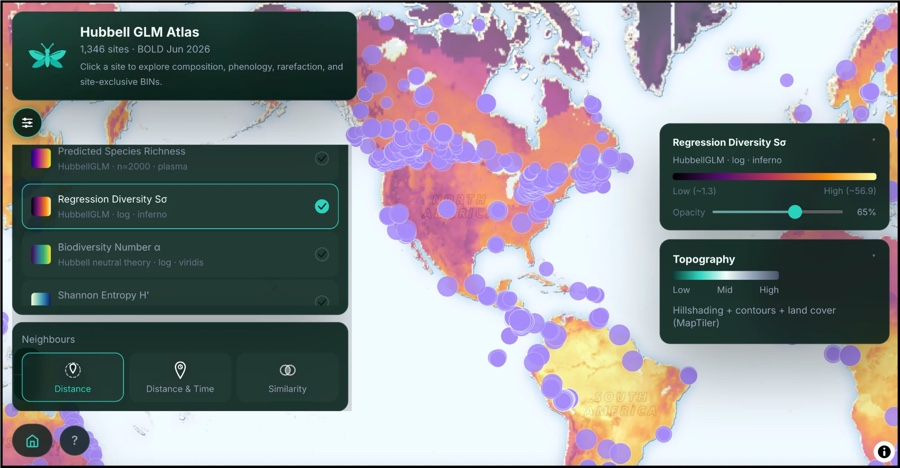
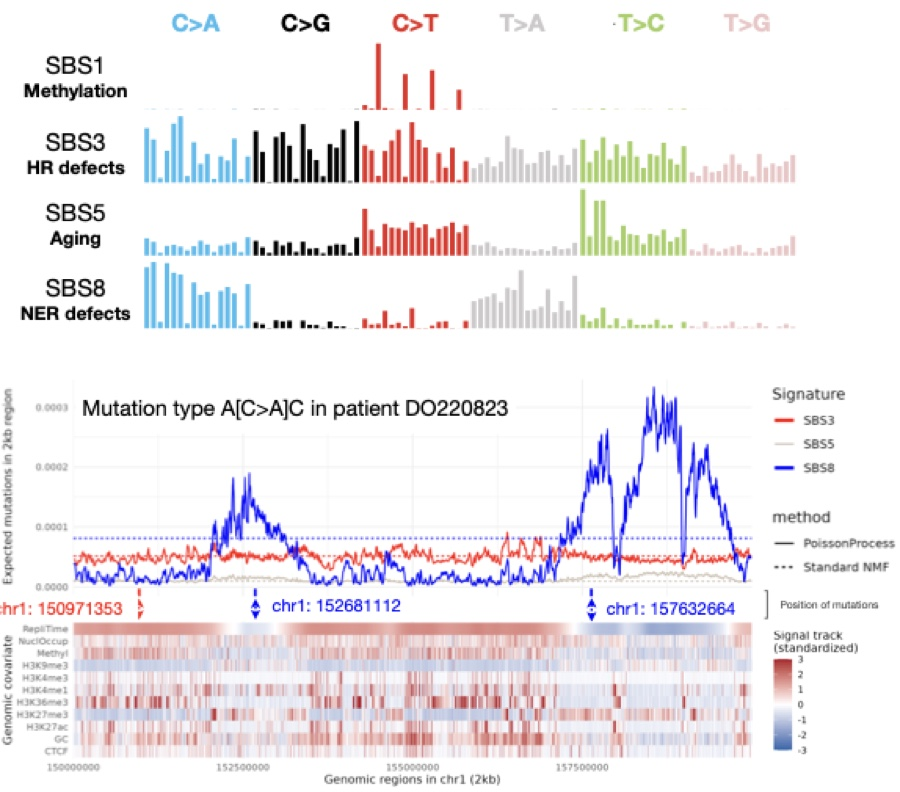
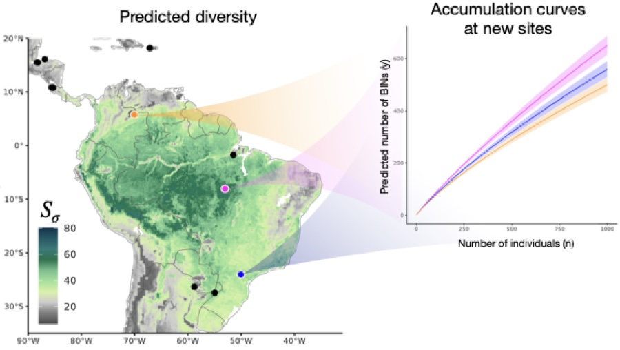
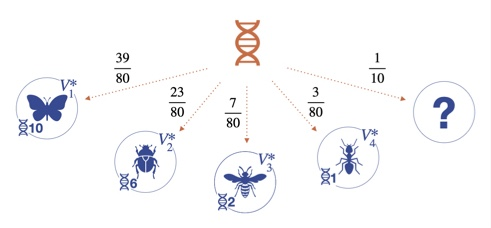
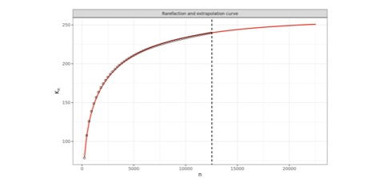
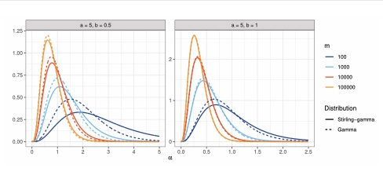
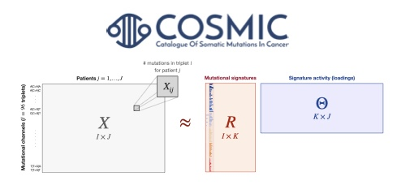
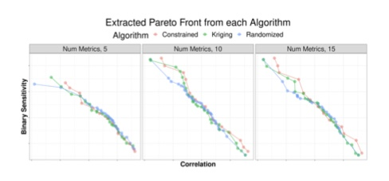

::: {.column-margin .dissertation-aside}
::: aside-highlight
### Highlight

I write easy-to-use software alongside my research, so that the methods can be picked up by scientists in my field and beyond. All software and tutorials I developed are accessible on this page.

:::
[GitHub](https://github.com/alessandrozito){.btn .btn-outline-primary role="button"}
:::

### [Interactive tools]{.blue} {.center}

------------------------------------------------------------------------

::: sw-item
::: sw-thumb

:::

::: sw-body
[**Hubbell GLM Atlas**]{.forestgreen}

DNA barcode-based arthropod composition across 1,346 passive-sampling monitoring sites from the Global Malaise Trap Program. Click a site to explore order composition, seasonal phenology, rarefaction and site-exclusive BINs.

[[Open the atlas](https://hubbellglm.org/arthropod-biodiversity/)]{.paper-links}
:::
:::

### [R packages]{.blue} {.center}

------------------------------------------------------------------------

::: sw-item
::: sw-thumb

:::

::: sw-body
[**SignaturePPF**]{.harvardred}

Poisson process factorization for mutational signature analysis. Models where mutations fall along the genome, not just how many, letting signature activity vary with genomic covariates.

[[GitHub](https://github.com/alessandrozito/SignaturePPF) [Tutorial](https://alessandrozito.github.io/SignaturePPF/vignette.html)]{.paper-links}
:::
:::

::: sw-item
::: sw-thumb

:::

::: sw-body
[**HubbellGLM**]{.forestgreen}

Hubbell regression for predicting biodiversity at unsampled locations, producing predicted species richness and accumulation curves for new sites from environmental covariates.

[[Website](https://alessandrozito.github.io/HubbellGLM/)]{.paper-links}
:::
:::

::: sw-item
::: sw-thumb

:::

::: sw-body
[**BayesANT**]{.orange}

BAYESiAn Nonparametric Taxonomic classifier. A DNA barcoding algorithm that classifies sequences within a hierarchical taxonomy while allowing novel species to be discovered in the test set.

[[GitHub](https://github.com/alessandrozito/BayesANT) [Tutorial](https://alessandrozito.github.io/BayesANT/vignette.html)]{.paper-links}
:::
:::

::: sw-item
::: sw-thumb

:::

::: sw-body
[**BNPvegan**]{.forestgreen}

Bayesian nonparametric methods for ecologists: species discovery, accumulation curves and estimates of how much diversity a sample has missed.

[[GitHub](https://github.com/alessandrozito/BNPvegan) [Tutorial](https://alessandrozito.github.io/BNPvegan/vignette.html)]{.paper-links}
:::
:::

::: sw-item
::: sw-thumb

:::

::: sw-body
[**ConjugateDP**]{.blue}

Random number generator for the Stirling-gamma distribution, the conjugate prior for the Dirichlet process precision parameter.

[[GitHub](https://github.com/alessandrozito/ConjugateDP)]{.paper-links}
:::
:::

::: sw-item
::: sw-thumb

:::

::: sw-body
[**CompressiveNMF**]{.harvardred}

Compressive Bayesian non-negative matrix factorization for mutational signature analysis, with a prior that shrinks away spurious signatures.

[[GitHub](https://github.com/alessandrozito/CompressiveNMF)]{.paper-links}
:::
:::

#### [Other projects]{.blue} {.left}

::: sw-item
::: sw-thumb

:::

::: sw-body
[**Proximity**]{.orange}

Pareto optimal proxy metrics. Code reproducing the empirical results in Zito et al. (2025). Property of Google LLC.

[[arXiv](https://arxiv.org/abs/2307.01000)]{.paper-links}
:::
:::
