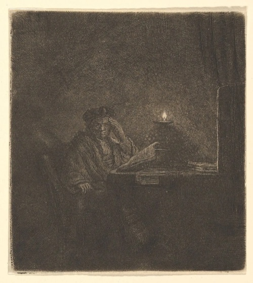

# Teaching philosophy {.central}

::: {.motto}
[**"Per Aspera ad Astra"**]{.harvardred} --- *through hardship to the stars*
:::

::: {.philo}
::: {.philo-text}
Learning is a journey pursued through patience, perseverance, and persistent dedication. This is especially true in the AI era, where fast solutions are cheap and tempting.

My goal as an instructor is to [inspire]{.blue} students and stimulate their [critical thinking]{.blue}, ensuring that they reach an adequate level of scientific literacy that will persist beyond the classroom.

I put specific effort in managing students' attention and pacing the rhythm of each lecture, using techniques I learned in my years spent as an actor. I also like to integrate recent developments in the research world into course materials to further stimulate curiosity and help students understand the practical utility of the subject.

:::

::: {.philo-art}

[Rembrandt, *Student at a Table by Candlelight*, ca. 1642 &middot; [The Met](https://www.metmuseum.org/art/collection/search/391694)]{.art-credit}
:::
:::

For my teaching activity at Duke University, I received the [**Teaching assistant of the year award**]{.harvardred} in 2021.

::: central
[Read here the student evaluations!](files/teaching_evaluations_alezito.pdf){.btn .btn-outline-primary role="button" target="_blank"}
:::

------------------------------------------------------------------------

### Teaching experience {.central}

-   \[[Fall 2026]{.blue}\] - Guest Instructor - Bayesian Statistics (undergraduate). Instructor: [Lorenzo Trippa](https://hsph.harvard.edu/profile/lorenzo-trippa/). Harvard University.
-   \[[Spring 2023]{.blue}\] - Teaching assistant, STA440 - Case Studies in the Practice of Statistics (undergraduate). Instructor: [Amy Herring](https://globalhealth.duke.edu/people/herring-amy). Duke University.
-   \[[Fall 2021]{.blue}\] - Teaching assistant, STA610 - Hierarchical models (graduate). Instructor: [Olanrewaju (Michael) Akande](https://www.olanrewajuakande.com/aboutme/). Duke University.
-   \[[Fall 2020]{.blue}\] - Teaching assistant, STA601 - Bayesian statistics (graduate). Instructor: [David B. Dunson](https://www.daviddunson.com/). Duke University. [Recipient of the 2021 Ph.D. Teaching Assistant of the Year]{.orange}.
-   \[[Spring 2020]{.blue}\] - Teaching assistant, STA360 - Bayesian statistics (undergraduate). Instructor: [Simon Mak](https://sites.google.com/view/simonmak/home). Duke University.
-   \[[2016-2018]{.blue}\] - Instructor at [TEST WE CAN srl](https://www.amazon.it/Manuale-TestWeCan/dp/B08YHDN38H) - a complete coursework designed to prepare high school students for the Bocconi admission test.
